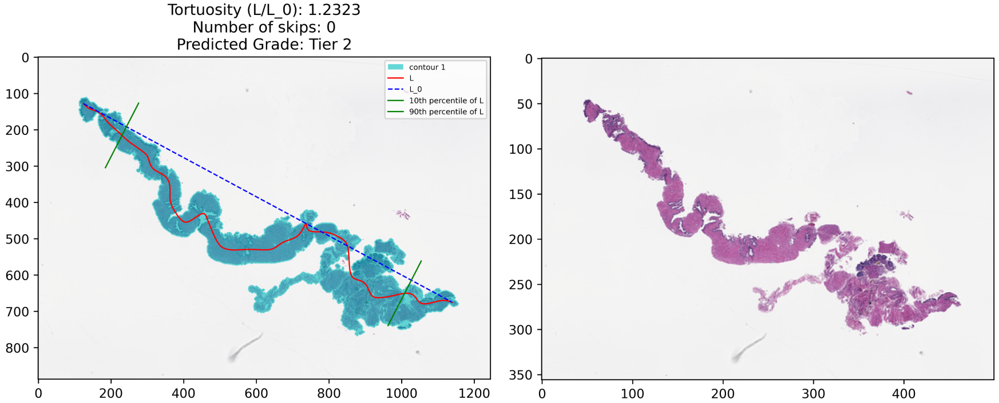
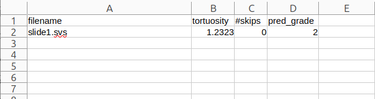

# BiopTort

BiopTort is a tool designed for quantifying tortuosity in core needle biopsies. Tortuosity is a measure of the twisting and turning of the biopsy path, and is a common yet largely unreported artifact in pathology.

## Features
BiopTort produces two types of output:

1. A `.pptx` file where each slide displays the qualitative BiopTort output:


2. A `.csv` file containing quantitative metrics extracted for each slide:


## Installation
### Using Docker
```bash
docker run -v <YOUR_DATA_PATH>:/data -it histotools/bioptort:main /bin/bash
```

## Usage
BiopTort exposes the following CLI options:
```bash
bioptort --help
```
```
usage: bioptort [-h] --im_path IM_PATH --ppt_save PPT_SAVE [--csv_save CSV_SAVE] [--mask_path MASK_PATH] [--sort] [--gauss_sigma GAUSS_SIGMA] [--override_base_magnification OVERRIDE_BASE_MAGNIFICATION] [--multiple_sections]

optional arguments:
  -h, --help            show this help message and exit
  --im_path IM_PATH     The directory containing (openslide-compatible) CNB WSIs.
  --ppt_save PPT_SAVE   The path to save the powerpoint presentation, including the filename.
  --csv_save CSV_SAVE   Optional path to save a csv file containing quantitative results, including the filename.
  --mask_path MASK_PATH
                        Optional path to existing png tissue masks for the CNB WSIs with matching filenames.
  --sort, -s            Sort the slides in order of highest to lowest tortuosity.
  --gauss_sigma GAUSS_SIGMA
                        The sigma value for the gaussian filter.
  --override_base_magnification OVERRIDE_BASE_MAGNIFICATION
                        Manually specify the base magnification of the WSI if it cannot be read from the file properties.
  --multiple_sections, -m
                        Experimental: Enable handling of multiple sections per slide. May not work as intended.
```

An example command to run BiopTort is as follows:
```bash
bioptort --im_path /data/ --ppt_save /data/<YOUR_PPT_NAME>.pptx --csv_save /data/<YOUR_CSV_NAME>.csv
```

## Citation
The related paper is published in the Archives of Pathology and Laboratory Medicine:

[https://meridian.allenpress.com/aplm/article/doi/10.5858/arpa.2025-0028-OA/508037](https://meridian.allenpress.com/aplm/article/doi/10.5858/arpa.2025-0028-OA/508037)

Please use below to cite this paper if you find this repository useful or if you use the software shared here in your research.

```
Jacobs, J., Wiener, D., Pathak, T., Farré, X., Mirtti, T., & Janowczyk, A. , "Standardized Reporting of Core Needle Biopsy Tortuosity: BiopTort—A Computer-Aided Protocol for Categorizing Tortuosity", Arch Pathol Lab Med 2025; doi: https://doi.org/10.5858/arpa.2025-0028-OA
```

```
@article{10.5858/arpa.2025-0028-OA,
    author = {Jacobs, Jackson and Wiener, Dan and Pathak, Tilak and Farré, Xavier and Mirtti, Tuomas and Janowczyk, Andrew},
    title = {Standardized Reporting of Core Needle Biopsy Tortuosity: BiopTort—A Computer-Aided Protocol for Categorizing Tortuosity},
    journal = {Archives of Pathology & Laboratory Medicine},
    year = {2025},
    month = {10},
    issn = {0003-9985},
    doi = {10.5858/arpa.2025-0028-OA},
    url = {https://doi.org/10.5858/arpa.2025-0028-OA},
    eprint = {https://meridian.allenpress.com/aplm/article-pdf/doi/10.5858/arpa.2025-0028-OA/3543274/10.5858_arpa.2025-0028-oa.pdf},
}
```
